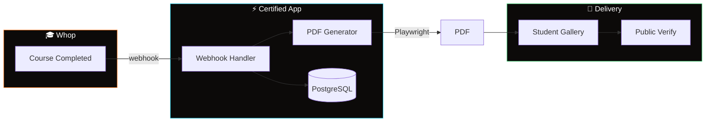

<div align="center">
  
  <p><strong>Auto-generates branded completion certificates for Whop course creators when students finish lessons.</strong></p>
</div>

# Certified — Auto-issue Certificates for Whop Courses

**Automatically generate branded completion certificates when students finish your Whop courses.** Solves the #1 requested feature in Courses app reviews with zero manual work — just connect your webhook and certificates appear instantly when lessons are completed.

🔗 **Live Demo:** https://whp-app.vercel.app/

## What It Does

- **Webhook Automation** — Listens to Whop course completion events and triggers certificate generation
- **Template Management** — Create branded certificate designs through a visual editor
- **Student Experience** — Auto-generated gallery where students view and download their certificates
- **Public Verification** — Shareable URLs to verify certificate authenticity
- **Course Control** — Toggle certificate generation per course, backfill for existing completions

## Why Use This

Course creators consistently request automated certificates, but building the webhook → PDF pipeline is complex. This handles the entire flow: webhook processing, template rendering, PDF generation, student delivery, and verification — all automatically.

## Architecture



## Features

### For Course Creators
- Dashboard to manage certificate templates and course settings
- Visual template editor with custom branding
- Bulk backfill certificates for students who completed before setup
- Analytics on certificate issuance and downloads

### For Students  
- Automatic certificate generation on course completion
- Clean gallery view of all earned certificates
- One-click PDF downloads
- Shareable verification links

### Technical
- Real-time webhook processing from Whop
- HTML-to-PDF generation with Playwright
- Role-based access control
- Public verification system

## Getting Started

### Prerequisites
- Whop app with course access
- PostgreSQL database (Neon, Supabase, etc.)
- Vercel account for deployment

### Installation

```bash
# Clone and install
git clone https://github.com/yourusername/whp-app.git
cd whp-app
pnpm install

# Set up database
cp .env.development .env.local
# Add your DATABASE_URL and WHOP_API_KEY
pnpm db:push

# Start development
pnpm dev
```

### Environment Variables

```bash
DATABASE_URL="postgresql://..."
WHOP_API_KEY="your_whop_api_key"
NEXTAUTH_SECRET="your_secret"
```

### Webhook Setup

1. Deploy to Vercel
2. In Whop Developer Dashboard, add webhook endpoint: `https://yourapp.vercel.app/api/whop/webhooks`
3. Subscribe to `course_lesson_interaction.completed` events

## Tech Stack

- **Framework:** Next.js 16 (App Router)
- **Database:** PostgreSQL + Prisma ORM  
- **Auth:** Whop SDK (@whop/sdk, @whop/react)
- **PDF Generation:** Playwright
- **Styling:** Tailwind CSS 4
- **Deployment:** Vercel

## Current Status

**✅ Core Features Complete**
- Webhook processing and certificate generation
- Dashboard for template/course management  
- Student certificate gallery and downloads
- Public verification system

**🚧 In Progress**
- Template editor polish and preview
- Email notifications for new certificates
- PDF caching and storage optimization

## API Routes

```
POST /api/whop/webhooks          # Whop webhook handler
GET  /api/certificates/[id]      # Certificate download
POST /api/templates              # Create certificate template
GET  /verify/[publicId]          # Public verification page
```

## Contributing

This is a functional Whop app template. Feel free to fork and customize for your specific certificate needs.

## License

MIT